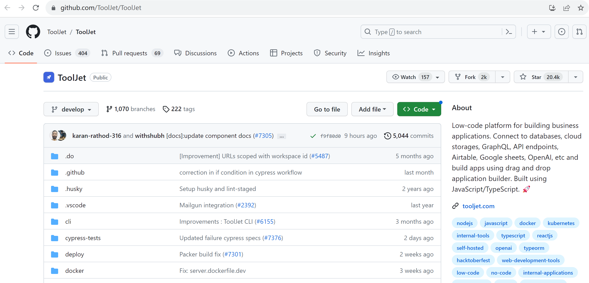

# 低代码笔记 part1：初识

#### fork 代码



#### 创建分支

```sh
git clone https://github.com/ToolJet/ToolJet.git
cd ToolJet
git checkout -b mybranch develop
```

#### 准备

```sh
npm install

npm run build:plugins
cp .env.example .env
```

下载 [postgresql](https://www.postgresql.org/download/), 并配置好数据库和账号。
编辑 [.env](.env)

#### 数据表创建和迁移

```sh
npm run db:migrate
```

#### 启动前端

```sh
cd frontend/

npm install
npm start
```

#### 启动后端

```sh
cd server/
npm install
npm start
```

#### 可能会遇到的问题

> frontend
>
> - 执行`npm install` 的时候，报错找不到 reactcss
> - webpack.config.js 的 html-loader 报错，暂时可改为 file-loader 代替。

> server
>
> - package.json **node engine** 版本不匹配，可改为
>   `engines: {"node": ">=18.3.0", "npm": ">=8.11.0"}`
